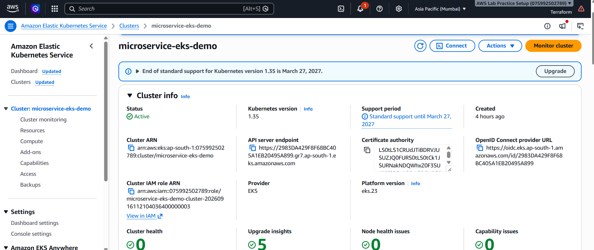
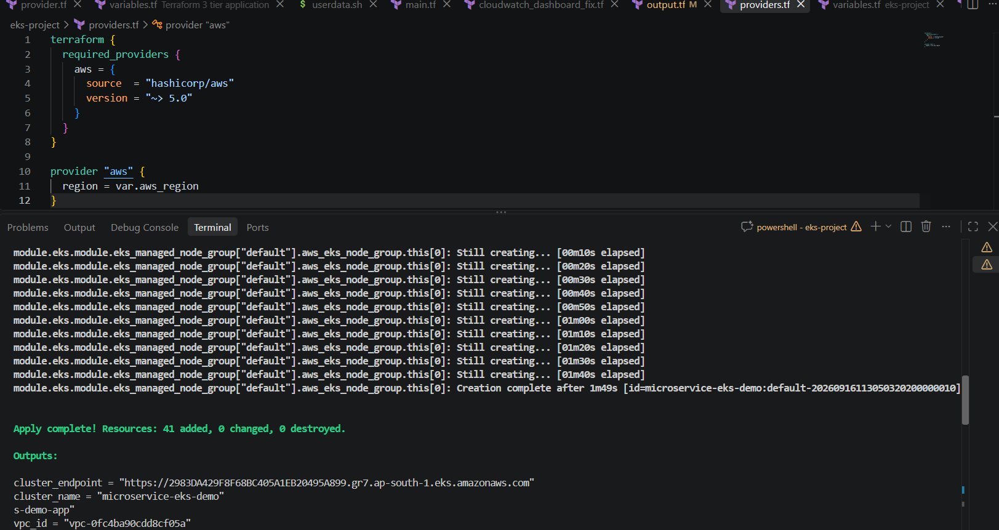

# Microservice Deployment on AWS EKS with Terraform and ALB Ingress

A cost-optimized, end-to-end DevOps project: two containerized microservices deployed on **Amazon EKS**, provisioned entirely with **Terraform**, exposed via an **AWS Application Load Balancer** through Kubernetes Ingress, with **GitHub Actions** (OIDC-authenticated, no stored AWS keys) automatically building and rolling out new versions on every push.

## Architecture

```
                         Internet
                            │
                     ┌──────▼───────┐
                     │  ALB (Ingress)│
                     └──────┬───────┘
                            │
        ┌───────────────────────────────────┐
        │           EKS Cluster              │
        │  ┌────────────┐   ┌─────────────┐  │
        │  │ orders-svc  │   │ products-svc │  │
        │  │ (Node.js)   │   │ (Python)     │  │
        │  └────────────┘   └─────────────┘  │
        │   Default VPC · public subnets     │
        └───────────────────────────────────┘
                            │
                     Images from Amazon ECR
```



## Tech Stack

- **Infrastructure as Code:** Terraform (EKS module, default VPC data sources)
- **Container Orchestration:** Amazon EKS (Kubernetes 1.29), managed node group on **Spot instances**
- **Ingress:** AWS Load Balancer Controller (installed via Helm) → provisions an ALB automatically from a Kubernetes `Ingress` resource
- **Microservices:** Node.js/Express (`orders-service`) and Python/Flask (`products-service`) — deliberately polyglot to demonstrate the platform is language-agnostic
- **CI/CD:** GitHub Actions, authenticated to AWS via **OIDC** (no long-lived access keys stored anywhere)
- **Registry:** Amazon ECR

## Cost-Optimization Decisions

This project was intentionally built to minimize AWS spend for a personal-account demo, while keeping the tradeoffs explicit and defensible:

| Decision | Why |
|---|---|
| No NAT Gateway | Biggest recurring EKS-adjacent cost (~$32/mo if left running); nodes use public IPs instead, protected by the EKS-managed node security group |
| Default VPC (not a new one) | Default VPC subnets already route to an Internet Gateway, avoiding NAT entirely; in a team/production setting, a dedicated VPC would be used |
| Spot instances for nodes | ~65-70% cheaper than On-Demand for a workload that tolerates interruption |
| Everything torn down after each session | `terraform destroy` after verifying — total cost for building this project was under $2 |

## CI/CD Pipeline

On every push to `main` touching `orders-service/`, `products-service/`, or `k8s/`:
1. GitHub Actions authenticates to AWS via **OIDC** (assumes an IAM role, no stored secrets)
2. Builds and tags the changed service's Docker image with the commit SHA
3. Pushes the image to Amazon ECR
4. Runs `kubectl set image` to perform a rolling update on the live EKS deployment
5. Waits for rollout to complete before marking the job successful


## Repository Structure

```
microservice-eks-terraform-alb/
├── .github/workflows/deploy.yml   # CI/CD pipeline
├── terraform/                     # All infrastructure as code
├── k8s/                           # Kubernetes manifests (Deployments, Ingress)
├── orders-service/                # Node.js/Express microservice
├── products-service/              # Python/Flask microservice
└── screenshots/                   # Proof-of-work images
```

## Setup / Reproduce This Project

1. `cd terraform && terraform init && terraform apply`
2. `aws eks update-kubeconfig --region ap-south-1 --name microservice-eks-demo`
3. Install AWS Load Balancer Controller via Helm (see `terraform/README-eks-setup.md` or project notes)
4. `kubectl apply -f k8s/`
5. Set up the OIDC IAM role and push code — GitHub Actions handles deployment from here

## Screenshots

| | |
|---|---|
| `terraform apply` output |  |
| Nodes ready |  |
| Pods running |  |
| ALB responding |  |

## What I'd Do Differently in Production

- Dedicated VPC with private subnets + NAT Gateway (or VPC endpoints) instead of the default VPC
- Terraform remote state in S3 + DynamoDB locking, instead of local state
- Scoped-down IAM permissions instead of broad policies used for learning speed
- Horizontal Pod Autoscaler and CloudWatch Container Insights for real traffic patterns

## Author

Built as a hands-on portfolio project to demonstrate practical AWS, Kubernetes, Terraform, and CI/CD skills.
