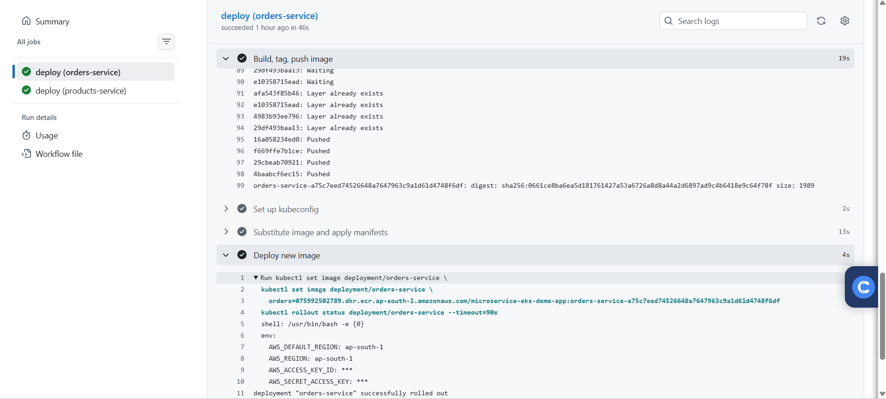
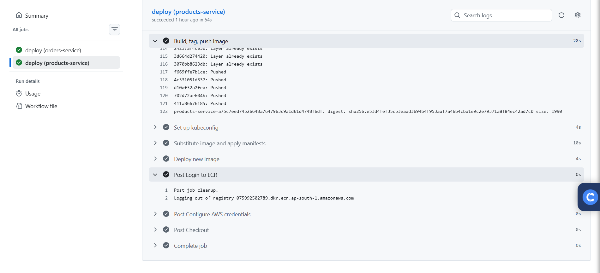
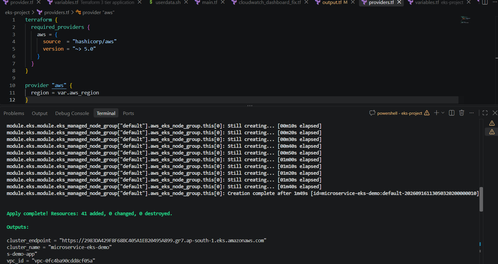
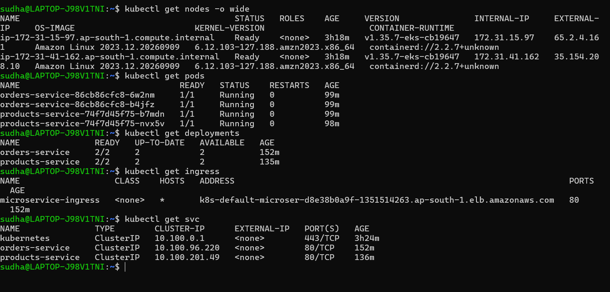
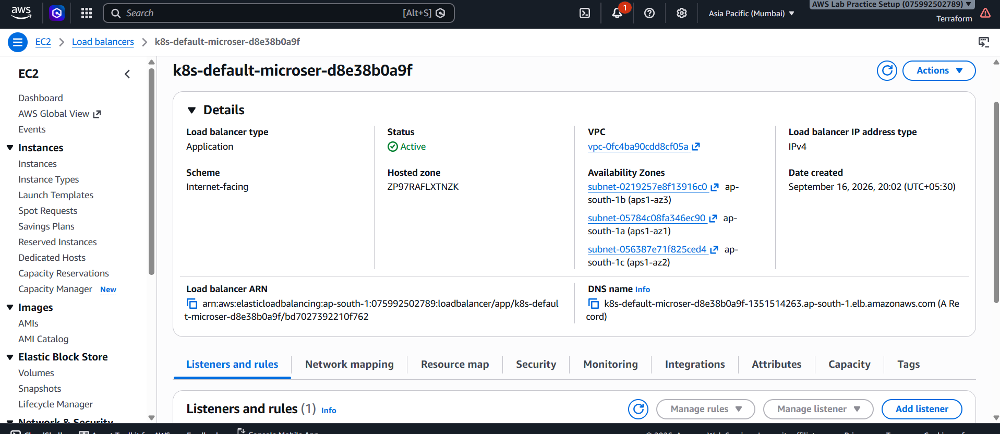
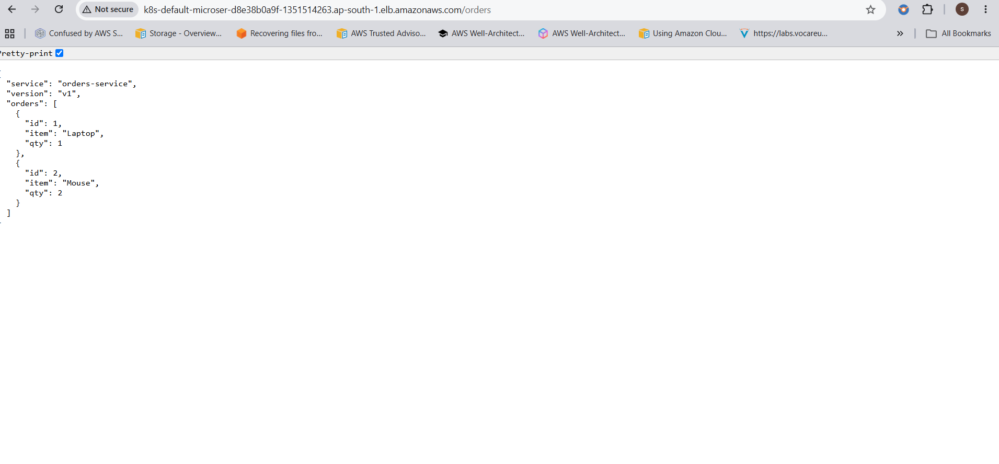
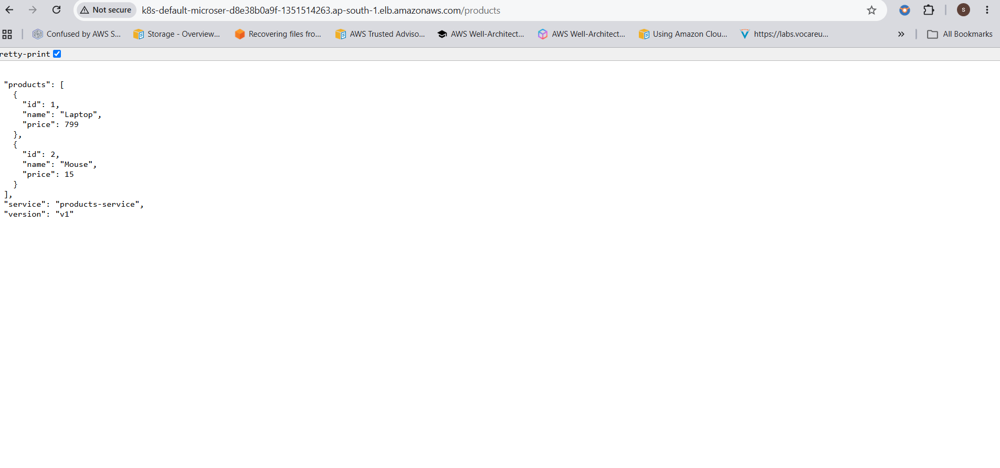

# Microservice Deployment on AWS EKS with Terraform and ALB Ingress

A cost-optimized, end-to-end DevOps project: two containerized microservices deployed on Amazon EKS, provisioned entirely with Terraform, exposed via an AWS Application Load Balancer through Kubernetes Ingress, with GitHub Actions automatically building and rolling out new versions on every push. CI/CD authenticates to AWS via a narrowly-scoped IAM user with access keys stored as encrypted GitHub secrets — a simple, appropriately-scoped approach for a single-repo pipeline.

## Architecture

 Architecture overview | 

## Tech Stack
Infrastructure as Code: Terraform (EKS module, default VPC data sources)
Container Orchestration: Amazon EKS (Kubernetes 1.29), managed node group on Spot instances
Ingress: AWS Load Balancer Controller (installed via Helm) → provisions an ALB automatically from a Kubernetes Ingress resource
Microservices: Node.js/Express (orders-service) and Python/Flask (products-service) — deliberately polyglot to demonstrate the platform is language-agnostic
CI/CD: GitHub Actions, authenticated to AWS via a narrowly-scoped IAM user (access keys stored as encrypted GitHub secrets)
Registry: Amazon ECR

## Cost-Optimization Decisions

This project was intentionally built to minimize AWS spend for a personal-account demo, while keeping the tradeoffs explicit and defensible:

## Cost-Optimization Decisions

This project was intentionally built to minimize AWS spend for a personal-account demo, while keeping the tradeoffs explicit and defensible:

Decision	Why
No NAT Gateway	Biggest recurring EKS-adjacent cost (~$32/mo if left running); nodes use public IPs instead, protected by the EKS-managed node security group
Default VPC (not a new one)	Default VPC subnets already route to an Internet Gateway, avoiding NAT entirely; in a team/production setting, a dedicated VPC would be used
Spot instances for nodes	~65-70% cheaper than On-Demand for a workload that tolerates interruption
Everything torn down after each session	terraform destroy after verifying — total cost for building this project was under $2

## CI/CD Pipeline

On every push to main touching orders-service/, products-service/, or k8s/:

GitHub Actions authenticates to AWS using a dedicated IAM user's access keys (stored as encrypted GitHub secrets)
Builds and tags the changed service's Docker image with the commit SHA
Pushes the image to Amazon ECR
Runs kubectl set image to perform a rolling update on the live EKS deployment
Waits for rollout to complete before marking the job successful


.

## Repository Structure

```text
microservice-eks-terraform-alb/
├── .github/workflows/deploy.yml   # CI/CD pipeline
├── terraform/                     # All infrastructure as code
├── k8s/                           # Kubernetes manifests (Deployments, Ingress)
├── orders-service/                # Node.js/Express microservice
├── products-service/              # Python/Flask microservice
└── screenshots/                   # Proof-of-work images

## Setup / Reproduce This Project

cd terraform && terraform init && terraform apply
aws eks update-kubeconfig --region ap-south-1 --name microservice-eks-demo
Install AWS Load Balancer Controller via Helm (see terraform/README-eks-setup.md or project notes)
kubectl apply -f k8s/
Create a scoped IAM user for CI/CD, add its access keys as GitHub repo secrets, map it in the cluster's aws-auth/access entries — GitHub Actions handles deployment from here

## Screenshots

| | |
|---|---|
| `terraform apply` output |  |
| Nodes ready |  |
| Ingress |  |

## Live application, routed through the ALB
| orders | . 
| products | .

## Notable Issues Solved During This Build

Real infrastructure work involves debugging, and this project hit several genuine issues worth documenting:

EKS Access Entries vs. legacy aws-auth ConfigMap — discovered the cluster was running in API_AND_CONFIG_MAP mode; resolved a Kubernetes RBAC authorization failure in the pipeline by creating a modern EKS Access Entry for the CI/CD IAM identity, rather than relying solely on the older ConfigMap-based method
Missing ALB Controller root-caused via logs — an Ingress resource with correct annotations and correctly tagged subnets still produced no load balancer; traced to the AWS Load Balancer Controller never having been installed on a freshly recreated cluster, confirmed via kubectl logs and fixed by reinstalling via Helm

## What I'd Do Differently in Production

Dedicated VPC with private subnets + NAT Gateway (or VPC endpoints) instead of the default VPC
Terraform remote state in S3 + DynamoDB locking, instead of local state
Scoped-down IAM permissions instead of broad policies used for learning speed
OIDC-based role assumption for GitHub Actions instead of stored access keys, to remove long-lived credentials entirely
Horizontal Pod Autoscaler and CloudWatch Container Insights for real traffic patterns

## Author

Built as a hands-on portfolio project to demonstrate practical AWS, Kubernetes, Terraform, and CI/CD skills.
